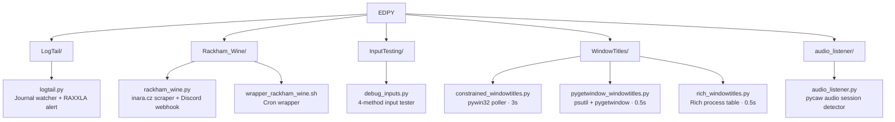

<div align="center">

# EDPY

**Out-of-game Python utilities for Elite: Dangerous** — monitoring, diagnostics, and notifications.

[](https://www.python.org/)
[](https://github.com/Quadstronaut/EDPY)
[](https://github.com/Quadstronaut/EDPY/commits/master)
[](https://github.com/Quadstronaut/EDPY)
[](https://github.com/Quadstronaut/EDPY)

[](#-scripts)
[](#-requirements)
[](#%EF%B8%8F-rackham-wine--configuration)
[](#-license)

</div>

> [!NOTE]
> None of these scripts inject input into a running game session during live play without explicit user action. These are out-of-game utilities only.

> **Full documentation:** [GitHub Wiki](https://github.com/Quadstronaut/EDPY/wiki)

---

<a id="scripts"></a>

## 📜 Scripts

| Folder | Script(s) | What it does | Platform |
|---|---|---|---|
| `LogTail/` | `logtail.py` | Watches Odyssey journal files in real time; counts every event type and persists counts across sessions. Alerts loudly if `RAXXLA` ever appears in a journal line. | Windows / Linux / macOS |
| `Rackham_Wine/` | `rackham_wine.py` + `wrapper_rackham_wine.sh` | Headless Selenium scraper for the Wine sell price at Rackham's Peak (via inara.cz). Fires a Discord webhook notification when the price crosses a configurable threshold; maintains a rolling 365-day price history. Designed to run as a cron job on a remote Linux host. | Linux (cron) |
| `InputTesting/` | `debug_inputs.py` | Interactive diagnostic tool — tests four distinct Windows input methods (`pydirectinput`, `pyautogui`, `win32api.keybd_event`, `win32api.PostMessage`) for sending a held <kbd>Numpad +</kbd> key to the Elite Dangerous window. Useful for verifying which method the game client accepts. | Windows only |
| `WindowTitles/` | `constrained_windowtitles.py` | Enumerates all top-level windows, finds `EliteDangerous64.exe` by process name (not window title), and polls its window title every 3 seconds using pywin32. | Windows only |
| `WindowTitles/` | `pygetwindow_windowtitles.py` | Alternative window-title poller using psutil + pygetwindow; polls every 0.5 s. | Windows only |
| `WindowTitles/` | `rich_windowtitles.py` | Process monitor that searches all running processes for a user-supplied string and renders results in a Rich table refreshing every 0.5 s. Window title column is a placeholder (`"Available"`) — not yet implemented. | Windows / Linux / macOS |
| `audio_listener/` | `audio_listener.py` | Polls Windows audio sessions (via pycaw) to detect whether specified Elite Dangerous client windows have active audio output. Exits with code `0` and prints `TRUE` when all configured windows are producing audio. | Windows only |



---

<a id="requirements"></a>

## 📦 Requirements

> [!TIP]
> Each script lists its own `pip install` requirements at the top of the file. Install per-script as needed — no single `requirements.txt` is provided.

**Python 3.9+ recommended.**

| Dependency | Used by |
|---|---|
| `watchdog` | `logtail.py` |
| `selenium`, `requests`, `python-dotenv` | `rackham_wine.py` |
| `pydirectinput`, `pyautogui`, `pywin32` | `debug_inputs.py` |
| `pywin32` | `constrained_windowtitles.py`, `audio_listener.py` |
| `psutil`, `pygetwindow` | `pygetwindow_windowtitles.py` |
| `psutil`, `rich` | `rich_windowtitles.py` |
| `pywin32`, `pycaw` | `audio_listener.py` |

---

<a id="rackham-wine-configuration"></a>

## ⚙️ Rackham Wine — configuration

Create a `.env` file in the `Rackham_Wine/` directory:

```bash
RACKHAM_WEBHOOK=https://discord.com/api/webhooks/...
```

The price threshold (`PRICE_THRESHOLD`), inara.cz URL (`INARA_URL`), and price history file path (`PRICE_FILE`) are constants at the top of `rackham_wine.py` — edit them directly.

> [!WARNING]
> `wrapper_rackham_wine.sh` contains two placeholder paths (`/foo/bar/...`) that **must** be updated to reflect the actual deployment directory before the script is run or added to crontab.

---

<a id="license"></a>

## 📄 License

MIT — see individual file headers where present. Author: Quadstronaut ([Quadstronaut](https://github.com/Quadstronaut)).
